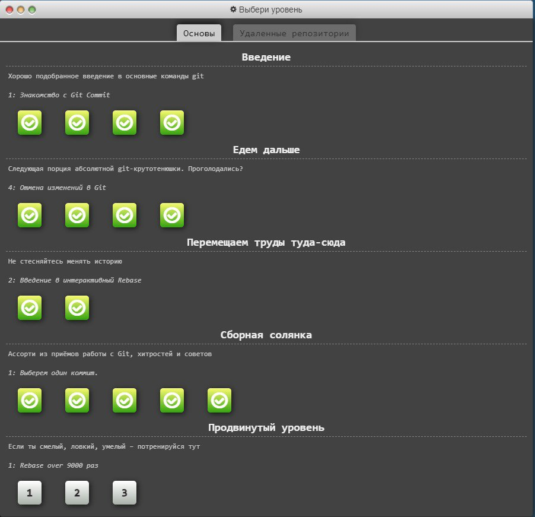
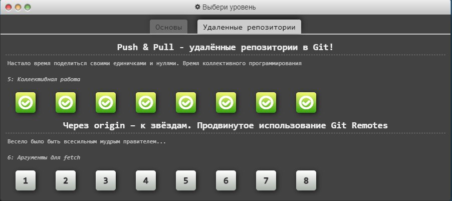
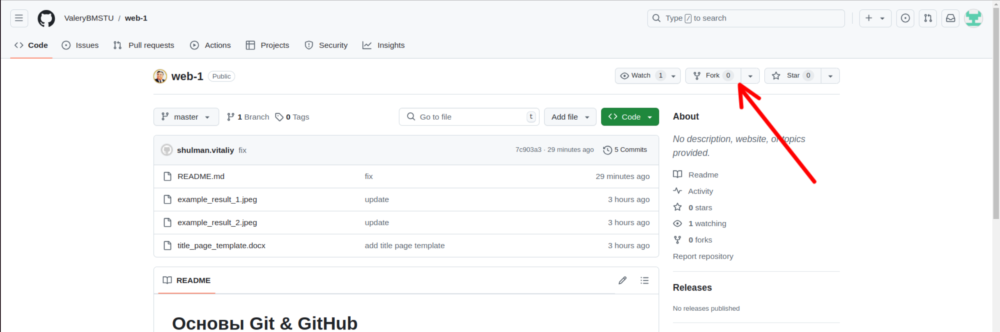

# Основы Git & GitHub

В рамках данной лабораторной работы предлагается освоить git - один из базовых инструментов любого разработчика.

Все лабораторные работы рекомендуется выполнять на операционных системах семейства Linux / Mac OS. При выполнении лабораторных работ на Windows могут возникать дополнительные сложности с настройкой используемых инструментов, а корректность работы приводимых примеров кода не гарантируется. 

## Основные теоретические сведения

Git - это консольная утилита, для отслеживания и ведения истории изменения файлов, в вашем проекте. Чаще всего его используют для кода, но можно и для других файлов. Например, для картинок - полезно для дизайнеров.

С помощью Git-a вы можете откатить свой проект до более старой версии, сравнивать, анализировать или сливать свои изменения в репозиторий.

Репозиторием называют хранилище вашего кода и историю его изменений. Git работает локально и все ваши репозитории хранятся в определенных папках на жестком диске.

Так же ваши репозитории можно хранить и в интернете. Обычно для этого используют GitHub.

## Порядок выполнения

1. Пройдите интерактивный курс по гит на https://learngitbranching.js.org/?locale=ru_RU. Необходимо выполнить задания во всех разделах, кроме "Продвинутый уровень" в закладке "Основы" и "Через origin – к звёздам. Продвинутое использование Git Remotes" в закладке "Удаленные репозитории". В конечном итоге должна иметь место следующая картина:  

 

 

2. Установите утилиту Git: https://git-scm.com/book/en/v2/Getting-Started-Installing-Git
3. Следуя инструкции https://dev.to/joshhortt/how-to-generate-and-add-an-ssh-key-to-github-1fe1, зарегистрируйтесь на https://github.com, сгенерируйте ssh-ключ и положите его в ваш личный кабинет  
4. Черзе интерфейс GitHub cделайте Fork данного репозитория:

 

5. Cклонируйте сфоркнутый репозиторий на свою локальную машину с помощью команды git clone 
6. Создайте локально от ветки master ветку dev и переключитесь на неё. 
7. Модифицируйте файл text.txt, заменив слово "world" на ваше имя, после чего проиндексируйте изменения с помощью команды git add ./text.txt и зафиксируйте изменения с помощью команды git commit -m "hello"
8. По аналогии с предыдущим шагом, добавьте отчёт по лабораторной работе в директорию docs в формате pdf (шаблон титульника находится там же)
9. Запушьте локальную dev-ветку в свой удаленный репозиторий GitHub и создайте merge request из dev в maste с помощью интерфейса GitHub
10. Продемонстрируйте результаты в ходе защиты лабораторной работы

## Содержание отчета

Отчет должен содержать листинги наборов команд гит для решения всех задач с https://learngitbranching.js.org/?locale=ru_RU, кроме задач "продвинутого" уровня.

## Контрольные вопросы

1. В чём разница между Git и Github?
2. Как можно объединить несколько комитов в один коммит?
3. Для чего нужен git rebase, если есть git merge?
4. Опишите назначение комманд: clone, add, pull, commit, push, merge, rebase
5. Как локально создать Git-репозиторий с нуля?

